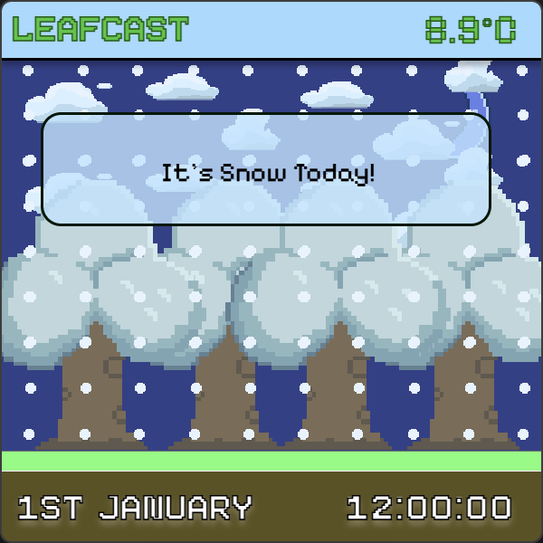
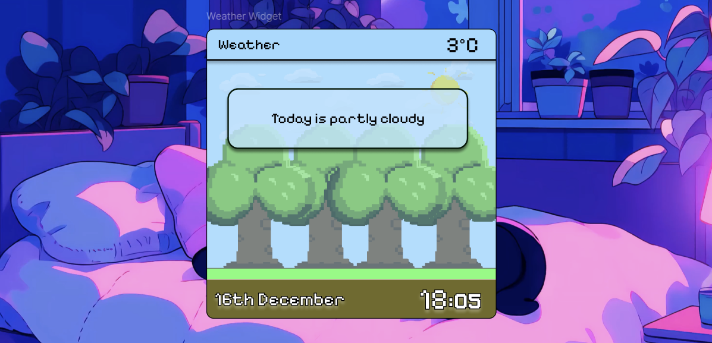

# Weather App

A desktop weather application built with HTML, CSS, Javascript and ElectronJS

## Features
- Simple desktop interface
- Fast and lightweight
- Get Date & Time
- Shows Temperature
- Displays current weather
- Changes display based on weather conditions
## Screenshot

<p align="center">
  
  
</p>
<p align="center">
  
  
</p>

## Files
| File / Folder | Purpose |
| --- | --- |
| `index.html` | HTML layout of the app |
| `styles.css` | All the styles for the app |
| `script.js` | Javascript running the code in the background |
| `assets/` | Contains Images, Icons needed for the app|
| `main.js` | Electron main process to create a desktop window and load UI |
| `.gitignore` | Files and folders ignored by Git |
| `package.json` | Project metadata & dependencies |
| `package-lock.json` | Auto-generated lock file for dependencies |
| `forge-config.js` | Settings used by Electron Forge to build and package the desktop app. |


## Installation

### 1. Clone the repository

```bash
git clone https://github.com/yourname/weather-app.git
cd weather-app
```
### 2. Install Node.js  
Make sure you have Node.js installed first:
```
npm install
```
### 3. Run the App Locally
```
npm start
```
This will open your Weather App Widget

## Packaging
If you want to package this program to run without the command line:
```
npm run package
```
This will create an "Out" folder containing the files for the program.

# Gallery
Sprites were created using Asperite
<p align="center">
  
  
</p>
<p align="center">
  
  
</p>

## Designing
Designing and Drafting were created using Figma
  
Figma Design File: https://www.figma.com/design/72vj7rLtmchiXWKGwgZFhP/Weather-App-Widget?m=auto&t=l29G6OfkNmNXwUka-1